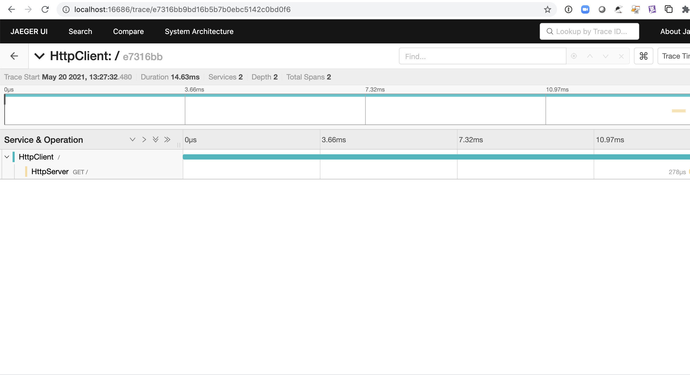

# Opentelemetry Tracing example in Java

## Instructions


A detailed step-by-step tutorial showing how tracing can be implemented for a simple java application 
issuing http calls to a http server. Both layers use the opentelemetry sdk and in this particular use case 
we will show how context propagation is handled.   


### Preliminary tasks and first time steps


***Project structure***
<br>
Let's first create our project structure

```sh
pejman@macosx:~ $ mkdir -p otel/opentelemetrylab otel/opentelemetry-collector-contrib
pejman@macosx:~ $ cd otel
pejman@macosx:~ otel $ ls -lrt
drwxr-xr-x   8 pejman  staff     256 Apr 23 18:48 opentelemetrylab
drwxr-xr-x   5 pejman  staff     160 Apr 23 18:48 opentelemetry-collector-contrib
```

***Clone this repository***

```sh
pejman@macosx:~ otel $ cd opentelemetrylab
pejman@macosx:~ opentelemetrylab $ git clone https://github.com/ptabasso2/opentelemetry-java-sampleapp.git
```


***Initial directory structure***

```sh
pejman@macosx:~ opentelemetrylab $ tree
.
├── README.md
├── build
├── build.gradle
├── gradle
│   └── wrapper
│       ├── gradle-wrapper.jar
│       └── gradle-wrapper.properties
├── gradlew
├── settings.gradle
└── src
    ├── main
    │   ├── java
    │   │   └── io
    │   │       └── opentelemetry
    │   │           └── otlp
    │   │               ├── ExampleConfiguration.java
    │   │               ├── HttpClient.java
    │   │               └── HttpServer.java
    │   └── resources
    └── test
        ├── java
        └── resources

```


### Download and install the collector binaries


```sh
pejman@macosx:~ opentelemetrylab $ cd ../opentelemetry-collector-contrib
pejman@macosx:~ opentelemetry-collector-contrib $ curl --output otelcontribcol_darwin_amd64 -O -L https://github.com/open-telemetry/opentelemetry-collector-contrib/releases/download/v0.27.0/otelcontribcol_darwin_amd64
pejman@macosx:~ opentelemetry-collector-contrib $ chmod +x opentelemetry-collector-contrib
```
For a linux environment you will want to download the following binary (instead of the one above):
https://github.com/open-telemetry/opentelemetry-collector-contrib/releases/download/v0.27.0/otelcontribcol_linux_amd64

### Configure the collector

```sh
pejman@macosx:~ opentelemetry-collector-contrib $ mkdir bin && cd bin
pejman@macosx:~ bin $ vi conf.yaml
```


Below an example of conf.yaml file.
<br>Please make sure you are using your API key. The one below is redacted. 
<br>Copy paste the following lines to the conf.yaml file, save and exit. 

```sh
receivers:
  otlp:
    protocols:
      grpc:
      http:

exporters:
  prometheus:
    endpoint: "0.0.0.0:8889"
    namespace: promexample
    const_labels:
      label1: value1
  
  logging:

  jaeger:
    endpoint: localhost:14250
    insecure: true
    
  datadog/api:
    hostname: customhostname
    env: prod
    service: myservice
    version: myversion
    tags:
      - example:tag
    api:
      key: 9847ecd1xxxxxxxx2064xxxxxxxdd3c2
      site: datadoghq.com

processors:
  batch:
    timeout: 10s

extensions:
  health_check:
  pprof:
    endpoint: :1888
  zpages:
    endpoint: :55679

service:
  extensions: [pprof, zpages, health_check]
  pipelines:
    traces:
      receivers: [otlp]
      processors: [batch]
      exporters: [datadog/api, jaeger]
    metrics:
      receivers: [otlp]
      processors: [batch]
      exporters: [logging,prometheus]

```

### Spin up the opentelemetry collector

```sh
pejman@macosx:~ bin $ nohup ./otelcontribcol_darwin_amd64 --config=./conf.yaml &
```

### Spin up the Jaeger Backend 

```sh
pejman@macosx:~ bin $ docker run -d --name jaeger \
-e COLLECTOR_ZIPKIN_HOST_PORT=:9411 \
-p 5775:5775/udp \
-p 6831:6831/udp \
-p 6832:6832/udp \
-p 5778:5778 \
-p 16686:16686 \
-p 14268:14268 \
-p 14250:14250 \
-p 9411:9411 \
jaegertracing/all-in-one:1.22
```


### Build the application

```sh
pejman@macosx:~ bin $ cd ../../opentelemetrylab
pejman@macosx:~ opentelemetrylab $
pejman@macosx:~ opentelemetrylab $ ./gradlew shadowJar
```

This build the final artifact `otel-0.1.0.jar` placed under `$HOME/otel/opentelemetrylab/build/libs`


### Running and testing the app
 
1. Starting the Http server first.
```sh
pejman@macosx:~ opentelemetrylab $ java -cp build/libs/otel-0.1.0.jar io.opentelemetry.otlp.HttpServer &
[1] 602
pejman@macosx:~ opentelemetrylab $ Server ready on http://127.0.0.1:8080
```

2. Starting the Http client 
```sh
pejman@macosx:~ opentelemetrylab $ java -cp build/libs/otel-0.1.0.jar io.opentelemetry.otlp.HttpClient
Served Client: /127.0.0.1:58434
Response Code: 200
Response Msg: Hello World!
```

### Checking the results

You can then navigate to `http://localhost:16686` to access the Jaeger UI.




